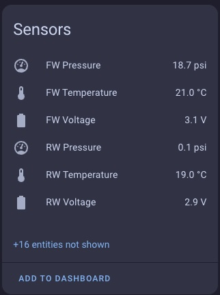
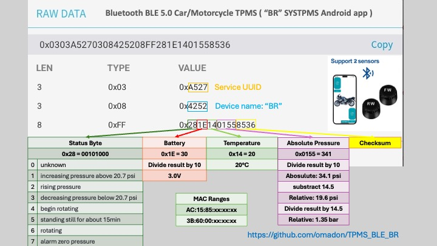
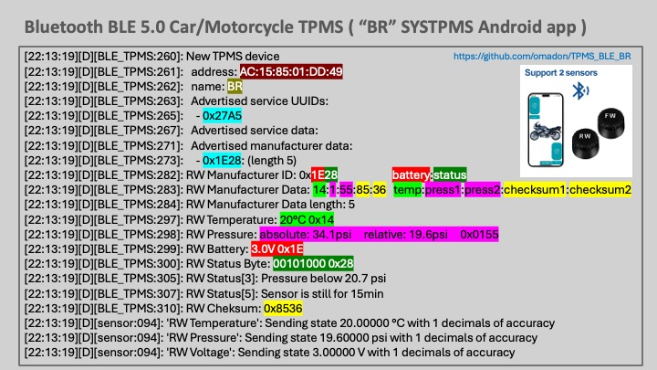

# ESP32 ESPHOME Bluetooth BLE 5.0 Car/Motorcycle TPMS
# "BR" SYSTPMS Android app

The model used for testing: https://vi.aliexpress.com/item/1005007476634600.html

ESP32 C3 : https://vi.aliexpress.com/item/1005006753245627.html (C3 Mini V2.1.0 - LOLIN WIFI Bluetooth LE BLE IOT Board ESP32-C3FH4 ESP32-C3 4MB FLASH MicroPython Arduino Compatible)

Work based on the: https://github.com/andi38/TPMS/

The TPMS sensors are sold on the alixpress and advertised as compatible with the outdated "SYTPMS" Android app.

The goal was to use the ESPHome framework and the ESP32 as a BLE tracker to read the TPMS sensors on my motorcycle when parked in the garage.
The ESP32 can be used as a standalone device without HomeAssistant integration because it has an internal web server. Of course, you will lose the ability for advanced automation and notification, but you will be able to read the sensor data without issue.

## Installation
### Standalone deployment
Follow the ESPHome installation tutorial at https://esphome.io/guides/installing_esphome.html

If you have python3 installed all you need is "**pip3 install esphome**".

Compile and install the ESP32 firmware:

- Download esp32-C3-01-2WD.yaml (motorcycle version) or esp32-C3-01-4WD.yaml (car version). 
- Download secrets.yaml and configure wifi settings and sensor MAC addresses.
- The sensor's mac address can be obtained using ESP32 in BLE tracker debug mode (see esp32-C3-01-2WD.yaml configuration options) or installing the "BLE Scanner" Android app. 
- If you have a fresh ESP32 with micropython, follow the procedure for erasing the microcontroler or enter into the flashing mode.
- Connect ESP32 with a serial cable (after the initial software deployment, OTA will be enabled and you can reflash using WiFi) 
- Run **esphome clean esp32-C3-01-2WD.yaml**
- Run **esphome run esp32-C3-01-2WD.yaml**
- After the compiling is finished, it will detect the USB serial connection and you can flash the microcontroller

If everything is ok you will see the console output of the ESP32 microcontroller trying to connect to the WiFi. If you don't see the TPMS data, verify the MAC addresses of the sensors listed in the secrets.yaml 
and try to unscrew and screw back the sensor to trigger BLE communication.

 ### HomeAssistant deployment
 Follow the guide to install ESPHome under HA: https://esphome.io/guides/getting_started_hassio.html

Configure the ESPHome:
 - On the left menu page choose ESPHome Compiler and click Add Device. 
 - Enter the sensor name (esp32-C3-01-2WD) and choose the device type, in our case ESP C3 variant. 
 - Abort the installation and click "Edit" on the sensor page. Paste the content of the esp32-C3-01-2WD.yaml file.
 - Click on the three dots, and choose Install

## TPMS Sensors 
- BLE scanner will detect sensors with a "BR" name.
- Sensors have MAC addresses from two ranges:
  - AC:15:85:00:00:00
  - 3B:60:00:00:23:33
- Sensor will advertise service "0x27a5" which is "pressure (pound-force per square inch)", check https://www.bluetooth.com/wp-content/uploads/Files/Specification/Assigned_Numbers.html
-   - 
- Values are encoded in the Manufacturer Data
  - Manufacturer ID will contain battery voltage and status byte
  - The rest of the Manufacturer Data will contain temperature and absolute pressure
  - Be aware, sensors report abosolute pressure, you must convert it to the relative presure 

Once pressurized they transmit when pressure changes and any couple of minutes. Rotation of a the wheel will trigger more frequent transmissions.

Example:
 - RAW DATA: 0x0303A527030842520308425208FF281E1401558536
   - Information is encoded in length/type/data structure
   - Here we have tree separate values
     - 0x0303A527 - size 3, type 3, A527
     - 0x03084252 - size 3, type 8, data 4252
     - 08FF281E1401558536 - size 8, type FF, data 281E1401558536
   - 0x27A5 Service UUID: pressure (pound-force per square inch)
   - 0x4252 Name: BR
   - 0x1E28 Manufacturer ID: 0x1E Battery voltage (3.0V), 0x28 Status byte (0b00101000)
   - 0x14 Temperature: 20C
   - 0x0155 Abosulute presure: 34.1 psi. relative pressure: 19.6psi (34.1-14.5)
   - 0x5836 checksum
   

